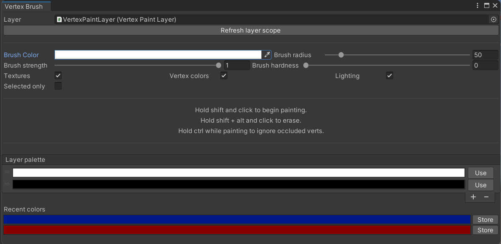

# VertexPaint Tool

## License
MIT License

Unity v2022.3.59  

## Table of Contents
1. [Purpose](#purpose)
2. [Features](#features)
3. [Installation](#installation)
4. [Simple How-to-Use](#simple-how-to-use)
5. [Documentation](#documentation)
6. [Limitations](#limitations)
7. [Troubleshooting](#troubleshooting)

---

## Purpose
The VertexPaint tool is designed to allow easy painting of vertex colors onto surfaces within Unity. It can be used to quickly paint lighting into the scene, like this:

## Features
- Paint or erase vertex colors directly onto meshes using a Photoshop-like brush tool.
- Supports variable brush size, opacity, and brush hardness.
- Can be occlusion-aware (only paint visible verts) or occlusion-agnostic based on settings.
- Save a standard palette of colors to your vertex layers for quick access.
- Preserves vertex color assignments even on mesh re-export.

## Installation
To set up your Unity package, follow these steps:
- Download the Unity package from the [Releases section](#).
- Import the package into your Unity project.

## Simple How-to-Use

1. Take a standard mesh GameObject (i.e., one with a `MeshFilter` and `MeshRenderer` component).
2. If it doesn't already have one, add a `VertexPaintable` component and a `MeshCollider` component.
3. Assign a material to the object with a shader that uses the `_VertexColorArray` property.
   - A sample shader has been provided to show a typical use case, so try using that shader first.
4. Create a GameObject for your parent layer and add a `VertexPaintLayer` component to it. Child the mesh GameObject to it.
5. Open the **VertexBrush** window (`Tools > VertexBrush`). In the "Layer" property at the top, assign your layer object.
6. Now, you can hold `Shift` and click to begin painting your vertex colors. Hold `Shift` and `Alt` to erase.
7. **Optional:** In the `VertexPaintLayer` component, set the Ambient Color and click the button **"Set Default Color for All."**
   - This makes unpainted vertices default to the chosen color. You can use this in a manner similar to the ambient environment color in the Render window.
8. Have fun!

## Documentation
Detailed documentation (hopefully) coming soon.

## Limitations
- **Mesh Size Limitations:** Meshes with more than 1024 vertices are not well supported. This is because arrays assigned in a `MaterialPropertyBlock` have a limit of 1024 entries. This restriction was considered acceptable for the original use case of modular sets in a low-poly retro style, but it would quickly become overly restrictive for conventional styles.
  - This limit could likely be increased with additional code work, but there are no plans for this at the moment.
  - Keep in mind that the vertex count in modeling software may differ from the "true" vertex count at the rendering level. A simple 8-vertex cube translates to 24 vertices for rendering, so the effective vertex limit is lower than it appears.
- **Layer Performance:** The paint tool checks all vertices in the current layer with each brush stroke. If your layer grows large enough, you may need to proactively subdivide your layers to keep the tool performant.
- **Collider Requirement:** The paint tool relies on physics-based raycasts to check for collision, so paintable objects must have a collider to receive brush strokes correctly. Once the colors are assigned, there is no requirement to keep the collider. This method may not be the most efficient, but there are no plans for improvement at this time.

## Troubleshooting

### Q: The mesh isn't affected by my brush strokes.
**A:** Ensure the following:
- The object has a `VertexPaintable` component and a `MeshCollider` component.
- The `MeshCollider` has correct geometry by removing and re-adding it.
- The object is childed to the `VertexPaintLayer` you're painting.
- The tool has up-to-date info about the `VertexPaintLayer`'s children by clicking **"Refresh Layer Scope"** in the brush window.
- "Selected only" is not toggled on in the Vertex Brush window.

### Q: The vertex colors broke after I reimported the mesh.
**A:** Select the affected object and press **"Refresh"** on the `VertexPaintable` component. You can also click **"Refresh All"** on the `VertexPaintLayer` component.
- The tool works by mapping colors to local positions, so it correctly handles retopologizing, changing of vertex indices, etc. New geometry won't have paint data, but existing colors won't be affected if you add new geometry.
- Changing the object's pivot or vertex positions will break the vertex colors irrevocably.

### Q: Brush strokes are lagging my computer.
**A:** You may need to have more granular paint layers. The more vertices in a paint layer, the more taxing the tool becomes. As a rough heuristic, a single medium-to-large size room probably merits its own paint layer. Apologies for the performance hit — but the tool remains snappy with good layer organization.

### Q: It's too hard to paint precisely.
**A:** Try toggling **"Selected only"** in the Brush Window settings. This option causes only the currently selected object to receive brush strokes.
